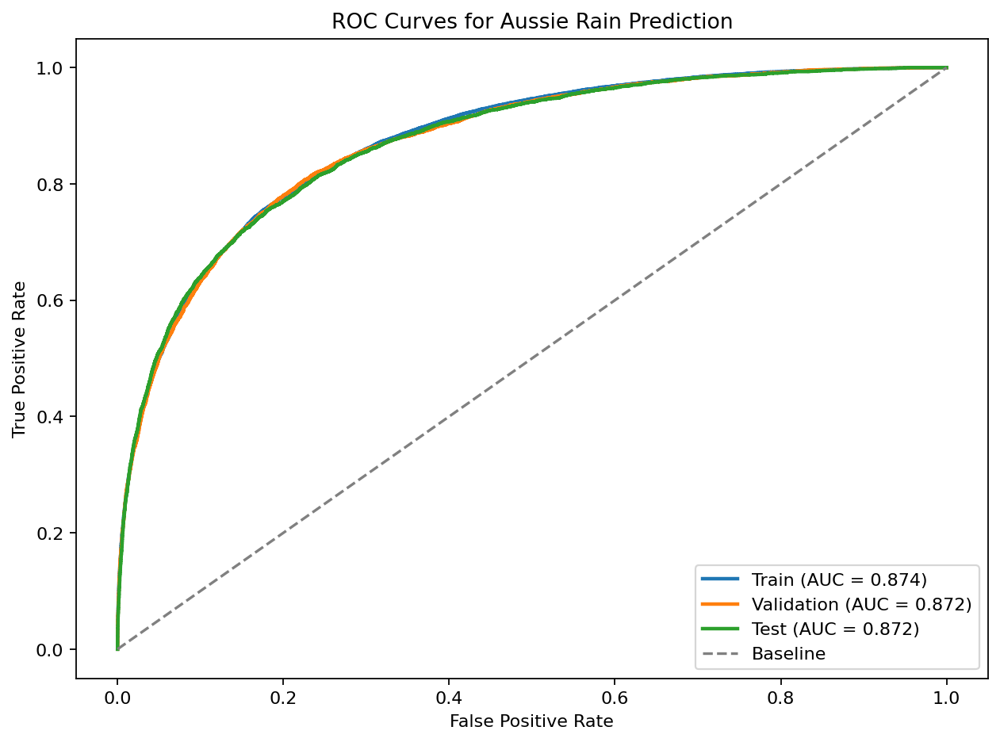

# Aussie Rain Prediction

Portfolio-ready machine learning project for predicting whether it will rain tomorrow in Australia.

## Project structure

- `EDA.ipynb` - exploratory data analysis and experimentation
- `app.py` - Streamlit entry point for deployment
- `train.py` - CLI script for retraining the saved model artifact
- `rain_predictor/` - reusable Python modules for data loading, preprocessing, modeling, and UI helpers
- `model/aussie_rain.joblib` - trained model artifact used by the app
- `.streamlit/config.toml` - Streamlit theme configuration for a cleaner portfolio presentation

## Run locally

```bash
streamlit run app.py
```

## Retrain the model

```bash
python train.py --data-path Data/weatherAUS.csv
```

## Model results

The saved logistic regression model was evaluated on the prepared dataset split used by the project pipeline.

| Split | Rows | Accuracy | F1 score (Yes) | ROC AUC |
| --- | ---: | ---: | ---: | ---: |
| Train | 84,471 | 0.8500 | 0.5993 | 0.8741 |
| Validation | 28,158 | 0.8503 | 0.5985 | 0.8718 |
| Test | 28,158 | 0.8518 | 0.6083 | 0.8718 |

## ROC AUC visualization



## Streamlit Cloud deployment

1. Push the contents of this folder to a GitHub repository.
2. Make sure these files are present in the repo root:
   - `app.py`
   - `requirements.txt`
   - `model/aussie_rain.joblib`
   - `rain_predictor/`
3. In Streamlit Cloud, create a new app and point it to `app.py`.
4. Deploy without the dataset if you only need inference. The app can run from the saved artifact alone.

## Portfolio notes

- The app is deployment-friendly because it uses package-based imports and project-relative paths.
- The notebook is kept for EDA, while production logic lives in reusable Python modules.
- `.gitignore` excludes local caches, virtual environments, and the raw dataset folder to keep the repository clean.

## Recommended GitHub repository contents

Keep in the repo:
- `app.py`
- `train.py`
- `rain_predictor/`
- `requirements.txt`
- `README.md`
- `EDA.ipynb`
- `model/`
- `image/`

Keep out of the repo:
- local virtual environments
- `__pycache__/`
- `.ipynb_checkpoints/`
- downloaded raw dataset files unless you explicitly want to publish them
